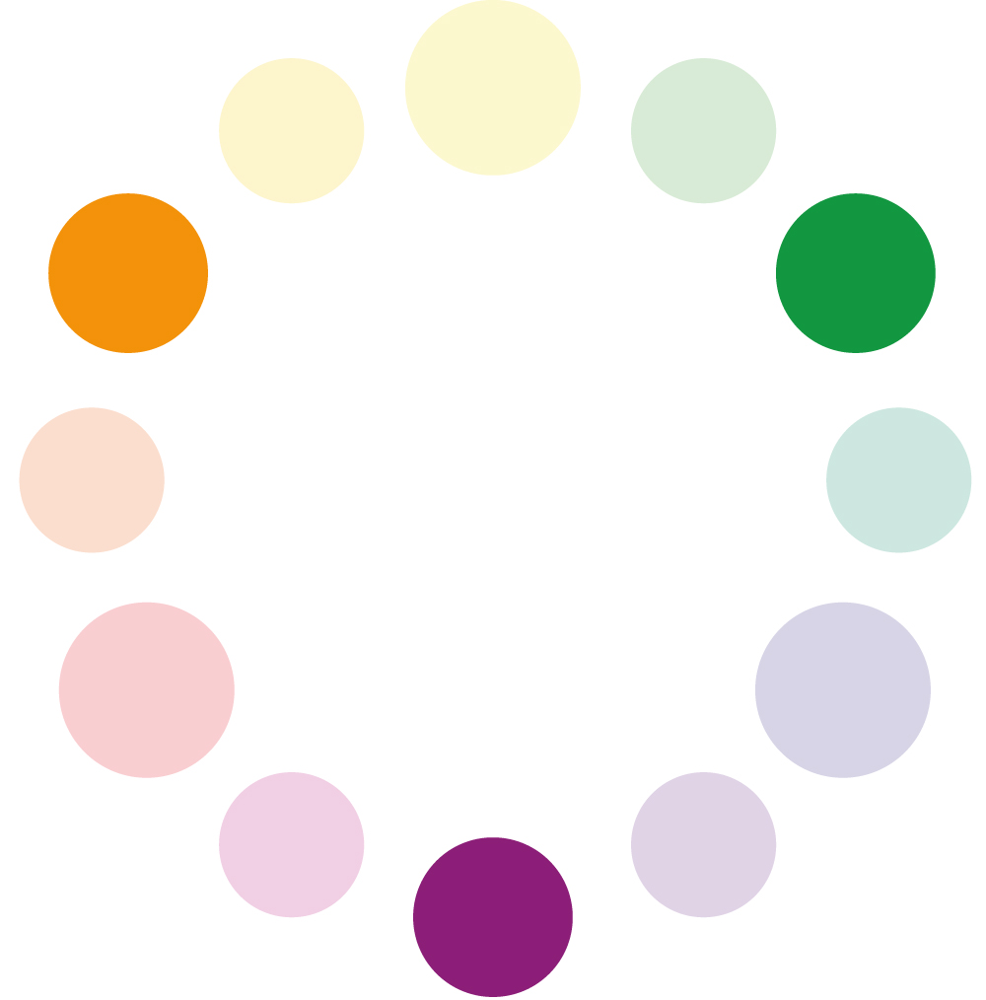
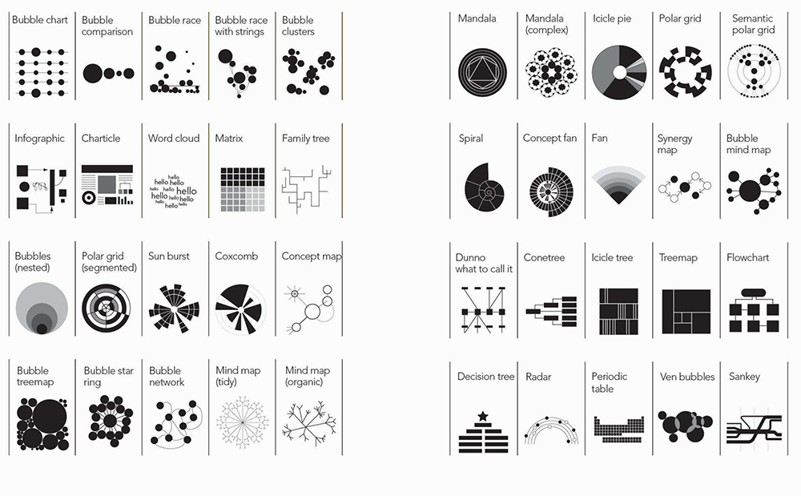

```{r setup, include=FALSE}
#library(sjPlot)
library(sjstats)
```


***

# Becoming Visual {.tabset}

## Colors

### Color theory

Color theory provides guidance on how to mix different colors together, and what effects these mixes can have on the viewer. An understanding of color theory helps to evaluate which colors work together, and which don't.

The color wheel depicts the color spectrum in a circle and is made up of three different types of colors: Primary, secondary, and tertiary colors. The primary colors are red, yellow, and blue. They are called primary for a couple of reasons.  First, no two colors can be mixed to create a primary color. Primary colors cannot be created by mixing together other colors, but only through the use of natural pigments. 

The secondary colors are orange, green, and purple.  Secondary colors are created by mixing equal parts of two primary colors. 
Tertiary colors are created by mixing equal parts of a secondary color and a primary color together.  There are six tertiary colors; red-purple, red-orange, blue-green, yellow-green, blue-purple, and yellow-orange. When naming the tertiary colors, the primary color is always named first. 


<div class = "row">
<div class = "col-md-4">

</div>

<div class = "col-md-4">

</div>

<div class = "col-md-4">

</div>
</div>

***

The color wheel can be divided into ranges that are visually active (warm colors) or passive (cold colors). Active colors appear stronger next to cold colors. 


{ width=75% }


***

### Color Schemes

Color schemes are practical guidlines on how to mix colors together.

*Monochromatic* means one (mono) color (chroma). A monochromatic color scheme consists of only one color and its shades and tints.


*Analogous colors* are next to each other on the color wheel. They can have an intense yet harmonic effect. 
 
*Complementary colors* are found directly across from each other on the color wheel. They provide a strong contrast.

*Color triads* are three colors that are equally spaced apart from each other on the color wheel. 

*Warm colors* are associated with warm things. 

*Cool colors* are usually associated with cold things. 

***

### Complementary Colors 

<div class = "row">
<div class = "col-md-6">

Complementary Colors  are located opposite each other on the color wheel.
Every visual presentation involves figure-ground relationships. This relationship between a subject (or figure) and its surrounding field (ground) will evidence a level of contrast; the more an object contrasts with its surrounds, the more visible it becomes.
</div>

<div class = "col-md-6">
{ width=75% }
</div>
</div>

<br>


Complementary colors can have interesting and intense effects. This may be a desirable effect, or a problem if there is text involved.

{ width=75% }


***

#### Color Values

Value is the darkness or lightness of a color.  When dealing with pure color (hue), value can be affected by adding white or black to a color. Adding white to a color produces a tint. Adding black to a color produces a shade.

{ width=75% }

***

### Color Blindness

Color blindness is the inability to differentiate certain colors. It comes in different forms, but the most common is red-green color blindness. There are multiple causes, but the most common cause is a mutated X Chromosome. Because men have only one X chromosome, they are more often affected by colorblindness Around 8% of adult men suffer from color blindness. Women on the other hand have two X chromosomes, which is why only few women are color blind. 

The most common type of color blindness is red green color blindness, this type affects about 95% of all color blind people. It means that the affected person can either not see the color red or green or both as colors but only as shades of grey, and hence not distinguish between them. The remaining 5% of colorblindness is made up of blue yellow color blindness, and less commonly – total color blindness. 

Below you can see an R package that tests graphic output for different types of color blindess. The first figure shows a graph as seen by a non-colorblind person. The second figure shows how different types of color blindness affect the vision of the same graph. The R package *colorblindr* can be downloaded  [here](https://github.com/clauswilke/colorblindr)

{ width=60% }


***

### Color Systems

*SUBTRACTIVE COLOR*

The subtractive method is applied when we paint or print colors. As you know from painting, if you add more and more layers of colors, the shade will get darker and end in black. 
This is where the CMYK (Cyan, Magenta, Yellow and Key Color) color system is used. 

*ADDITIVE COLOR*

On digital screens, colors are created with light. If we do not have any light, we see black. The more colors we add, the lighter it gets and ends in white. 
This is when the RGB color system is applied. Most pictures you find on the internet are in the RGB mode and thus not printable. Although most modern office printers automatically convert the colors to CMYK mode, you need to take the color mode into consideration when submitting to a professional printer. 

### Tools to help you choose your colors

The following websites help you choose a harmonic color palette:

http://paletton.com

https://mycolor.space

https://coolors.co 

## Fonts


### What is Typography?
Typography is the style, arrangement, or appearance of typeset matter
The main goal of typography is presenting information in a way that is readable and easy to consume.

### Classifications

*Serif*
these typefaces are the more traditional ones. “Serifs” are
the little feet or arms that hang off the end of letter strokes, and typically
add a thick/thin look to the letter. Serif fonts are considered the easiest
fonts to read so they are most often used as text or “body” copy

*Sans-Serif*
As the name suggests, sans-serif fonts are 'without serifs' and usually have an overall even stroke weight. Sans serif fonts can evoke a more modern look because they were not created until the 19th century. While they can also be harder to read, they are often used only for small amounts of copy, subheadings, or large headlines. Helvetica is the most universal sans serif font as it is used around the world.

<br>

For large amounts of text, serif fonts are generally thought to move the eye along more effectively and increase reading speed, especially in print (though this obviously depends the characteristics of the specific font used). On the other hand, sans-serif fonts are often favored for online/on-screen text due to their simplified letterforms that display more clearly at various screen resolutions.

### Alignment

- align left

- align right

- align center

- justified

### Widows & Orphans
If a single word or very short line is left at the end of a column it is called a Widow. Likewise if the same is left at the top of the following column this is called an Orphan. Both of these are considered bad typography as they cause distracting shapes in a block of type. They can usually be fixed easily in the same way as the rag, by reworking the line breaks in the column or by editing the copy.

<div class = "row">
<div class = "col-md-6">


</div>

<div class = "col-md-6">


</div>
</div>

### Anatomy


### Basic Typography rules

point size should be 10–12 points in printed documents, 15-25 pixels on the web.

line spacing should be 120–145% of the point size.

The average line length should be 45–90 characters (including spaces).

Never use underlining, except perhaps for web links.

Use centered text sparingly.

Use bold or italic as little as possible.

### How to combine fonts

Before we start looking for a font to add to our design and combine it with our body text font, we need to ask ourselves: do we really need more than one font? Don’t just add one for the sake of it. There’s no rule in typography that says the more fonts used the better (the contrary is probably more true).

One of the main reasons that pairing serif and sans-serif fonts works so well is that it creates contrast. This idea of contrast brings together multiple concepts that you should be considering, including hierarchy and how fonts complement each other.

Contrast can be achieved in a number of ways, including through style, size, weight, spacing, and color, among others. In the example below, a bold, chunky font is paired with a tall, thin one—and although they’re almost complete opposites, they work nicely together in large part because they are so different. The differences help create distinct roles for each font, allowing them to stand out as individual pieces of information.

When combining fonts, you do want contrast, but you don’t want conflict. Just because fonts are different doesn’t mean they will automatically work well together. Generally speaking, typefaces that share a couple qualities—maybe they have similar proportions, or the lowercase letters have the same height (known as “x-height”)—are more likely to look harmonious together, even if the overall appearance differs.

choosing fonts that are too similar (i.e., don’t have enough contrast) becomes problematic. You’ll have trouble establishing a hierarchy because the fonts aren’t visually distinguishable from each other. And any differences that are discernible may look more like a mistake than a purposeful choice.


### Tools for Typography

https://medium.muz.li/typography-that-sacred-cow-ea7a5909ca70

Font Combinations: 
https://www.canva.com/font-combinations/ 
https://archetypeapp.com/

## Technicalities

### Pixel vs. Vector
The key difference between pixel and vector based graphics is how the image is structured. Pixel based graphics are made up from lots of tiny physical squares (or ‘pixels’) where as vector graphics are mapped out using mathematical equations which calculate where the edges of the shapes sit in relation to one another.

As an example; fonts are always created using vectors so that the colours can be changed efficiently and the symbol can be easily scaled up to any size without losing quality. In contrast, digital photographs are always made up of pixels, which allows for a much more efficient blending of the colours as each physical pixel block can be coloured individually – rather than each shape being mapped out and filled with a gradient, as it would have to be if it were made up using vectors.

{ width=50% }


Pixel graphics use a grid of small, square picture elements (pixels) for displaying graphics. Each pixel has a particular position and a particular colour value. The total number of pixels in an image is always the same. If the image is enlarged, the resolution is reduced. Then the image often looks “jagged“. If an interpolation is used the image looks smooth
but not as sharp. 
Dataforms: JPG, PNG, TIFF, GIF, PSD, BMP

Vector graphics are created from mathematically defined lines (vectors) and curves.
Vectors draw pictures on the basis of their geometrical characteristics. Vector graphics are not defined by a fixed number of pixels. Therefore they are not dependent on resolution.
During expansion the contours are scaled without affecting the quality of the pictures or increasing the quantity of data. Vector graphics are always displayed or printed in the resolution of the relevant output device. Therefore they are suitable for showing sharp contours and details.
Dataforms: PDF, EPS, AI, CDR, WMF,

### Dataforms


|               | EPS                                                                                                                                                                                                   | GIF                                                                                                                                          | JPEG                                                                                                                                                                   | PDF                                                                                                             | TIFF                                                                                                                                |
|---------------|-------------------------------------------------------------------------------------------------------------------------------------------------------------------------------------------------------|----------------------------------------------------------------------------------------------------------------------------------------------|------------------------------------------------------------------------------------------------------------------------------------------------------------------------|-----------------------------------------------------------------------------------------------------------------|-------------------------------------------------------------------------------------------------------------------------------------|
| Description   | EPS (Encapsulated PostScript) is actually a page description language but is also used for describing images, and especially vector graphics.                                                         | GIF is in most cases used for screen presentations and animations.                                                                           | JPEG (Joint Photographics Experts Group) is the most common format on the Internet because it allows to compress images a lot without limiting the color range such as in GIFs .                           |  PDF (Portable Document Format) is produced by Adobe Acrobat and the format is based on PostScript (PS) format. |  TIFF (Tagged Image File Format) is one of the most common formats.                                                                 |
| Purpose       | A platform-independent printing format.                                                                                                                                                               | GIF (Grafic Interchange Format) is the perfect dataform for Internet figures that only requires up to 256 indexed colours.                                               | Internet publications, presentations, never for print!                                                                                                                 | A cross application/platform description and publishing format.                                                 | Platform independent format for photos etc. TIFF has become a defacto standard for pixel images.                                    |
| Advantages    | EPS has been a de facto standard within the graphic industry during the last fifteen years. It offers a very good printing quality on PS-printers. EPS is mostly used for storing vector information. | Most image software can import and export GIF-files. The file format offers extremely small files which is ideal for internet publications.  | The format offers a very good compression, especially for photos. Thecompression will reduce the file size by approximately 5 to 20 times.                             | Very good printing quality. A standard in desktop publishing. All information will be stored inside a PDF.      | The format is supported in almost every image and word processing software, and it does not compress the data. Ideal for printing.  |
| Disadvantages | There are sometimes problems when printing these files on printers that don’t support the Postscript format.                                                                                          | Maximum 256 colours can be stored in the file. That means that there is always a quality loss when you use it for photos.                    | The format uses a lossy compression. This means that you will loose information every time you save the image.You should not use JPEG as a master copy of your images. | Only limited options to edit a PDF-file.                                                                        | Large images require large storage space. Not the best format for online publications.                                              |

### Image Resolutions

To determine whether your raster images are a suitable resolution for a specific application, you need to check their pixel density. Units of measurement such as dots per inch (DPI) or pixels per inch (PPI) refer to the number of pixels in one inch of the image. These measurements become important when you attempt to use raster images in specific places, such as on the web or in print publications.

The web, historically, displays 72dpi (72 dots or pixels per inch) – a relatively low pixel density however most modern displays are now much higher. That said many images on the web are still in that 72-100 dpi range. While monitors can display higher resolution the web also needs to optimized for speed so images around 100 dpi hit the sweet spot for looking great on a screen but also loading quickly. Raster images with a low DPI in the 72-100 look nice and crisp on the web. But this same low DPI image may not be suitable for printing on a brochure or packaging. To correctly print an image, it should be at least 300dpi, a much higher pixel density than the web displays. Resizing a low DPI image pulled from the web to fit the dimensions of your print project won’t work because the same finite number of pixels only get bigger and begin to distort. For example, let’s say you want to print your logo at 2″x3″ on a brochure. If have a 72dpi jpg of your logo and it’s 2-inches by 3-inches, it will need to be “stretched” to more than 3 times the size to get it up to 300dpi. That 72dpi logo may look great on your computer monitor, but when it prints at 300dpi it will look pixilated. Instead you should use a vector version of your logo (.EPS or .AI) or create a raster (JPG) with the exact dimensions desired and at 300dpi.

***

# Data Visualization {.tabset}

## Basic Principles 

Visualization may not be as precise as statistics, but it provides a unique view onto data that can make it much easier to discover interesting structures than numerical methods. Visualization also provides the context necessary to make better choices and to be more careful when fitting models. Anscombe’s Quartet is a case in point, showing that four datasets that have identical statistical properties can indeed be very different.


When we visualize data, it means that we are encoding data into visual forms such as colors, size, shape, etc. Although our data pretty much decides which type of graphs we can consider, the human brain cannot decode the information of all types of data visualization equally. 

In the mid-1980s, Cleveland and McGill (1985) ran [experiments](http://courses.ischool.berkeley.edu/i247/f05/readings/Cleveland_GraphicalPerception_Science85.pdf) measuring how accurately people were able to perceive the quantitative information encoded by different types of data visualization. People were asked to estimate two values within a chart, or compare values between charts. 
In 2010, Heer & Bostock (2010) [replicated](https://dl.acm.org/citation.cfm?id=1753357) Cleveland’s earlier experiments and added additional assessments, such as rectangular-area graphs. 

The overall pattern of results shows less accurate perception as we move from length-based scales to angles and finally areas. 


*Schematic representation of basic perceptual tasks for nine chart types, by Heer and Bostock, following Cleveland and McGill. In both studies, participants were asked to make comparisons of highlighted portions of each chart type, and say which was smaller.*

We best judge a quantity if we have a clear scale on which elements are aligned, such as a denoted y-axis for bar charts. When elements are not clearly marked by a scale, comparison is a bit harder but still good. It is more difficult again to compare the lengths of lines without a common baseline.

We tend to misjudge quantities represented as angles. This is why pie charts are usually a bad idea. We also misjudge areas. We have known for a long time that area-based comparisons of quantities are easily misinterpreted or exaggerated. For example, values in the data might be encoded as lengths which are then squared to make the shape on the graph. The result is that the difference in size between the squares or rectangles area will be much larger than the difference between the two numbers they represent. 


Finally, three-dimensional visualization of data is hardest to interprete. 
Our ability to scan the dimension of depth (z-axis) is weaker than our ability to grasp the x and y axes. Three-dimensional visualization can look impressive, but they are also harder to judge.


***

### Which chart type should I use?

This is a frequently asked question, and the answer is: There is no best answer. However, you should ask by asking yourself “What would you like to show?”.  Below you can see a basic framework to identify different chart types for different data types. Experiment with different charts to see which chart works best to tell the story in your data.

<br>


The most important question you should always ask is: "“What is it about the data that I would like to visualize?”. The struggle of a good visualization is often find not a visualization problem, but an operationalization problem.

Information visualization is not an art, but a systematic process. You need to clarify which attributes of your data you want to highlight, and how these attributes relate to other attributes in the data. 


*When is data visualization useful? *

The less straight-forward the answer to your question, the more useful data visualization might be. If your question is 'how many toothpastes did our company sell in a given year?', you do not need to visualize the numeric answer to that question. However, if you ask how did our toothpaste sells do compared to other toothpaste companies in a given year, a graphic visualization might be useful to look at the differences and comparisons. Vague questions require you to look at your data from different perspectives and angles. Visualizating your data for vague questions can thus be useful to draw inferences based on your own knowledge. 

In most statistic courses for social scientists, creating a graph is part of your statistical analysis. You're being taught to create a graph from your results, to show your effects, or maybe look at the distribution of your data visually. 

This ignors that information visualization can be of much greater use than only showing the outcome of an analysis. In fact, the most cited parts of a paper are usually the parts exploring, describing and interpreting the data at hand, which typically requires good and simple visualization. Exploring data visually might then give you indices on how to further work with the data, e.g. statistical analysis, machine learning, network analysis, etc. In other words, information visualization can be vital in the step to a successful operationalization. 

*Types of information visualization*





### Tables

Tables are usually better than graphics for 20 or less numbers. The special power of graphics comes with large datasets. Tables also work well when the data presentation requires many localized comparisons. 


{ width=65% }


Tables are often presented with rows/cols ordered alphabetically which is good for looking up specific values, but it is bad for seeing patterns, trends, anomalies. It is better to sort rows or columns by means or medians and to shade cells according to values. If you are going to present the numbers, round a lot. Nobody wants to see all those decimals. 

<div class = "row">
<div class = "col-md-6">


</div>

<div class = "col-md-6">


</div>
</div>

## Good and Bad Graphs 

Like good writing, good graphical displays of data communicate ideas with clarity, precision, and efficiency.
Like poor writing, bad graphical displays distort or obscure the data, make it harder to understand or compare, or otherwise thwart the communicative effect which the graph should convey.

### Good Figures
Coming across a good visualization in this dense information jungle nowadays is a relief, because it is effortless and just poures in. 

After pie charts, double Y-axis graphs have caused more trouble
than almost any other

When we look at maps, we tend to focus on the substantive matter of the data and don't primarily think about the methodology behind it. 

*Time-Series*

A random sample of 4'000 graphics from 15 popular newspapers and magazins from around the world between 2974 and 1980 showed that 75% of these graphics displayed time-series Tufte (1983). 
The strength of time-series is the natural ordering of the time scale, and the ability to make big data sets with lots of variability easily visual. 

Adding an addiitonal space dimension to time-series (if your data allows) increases explanatory power. The following examples show complex multivariate graphics that are so easy to understand that viewers barely notice the multiple dimensions. 


*Narrative Graphics of Time and Space*

<<<<<<< HEAD


*Visual Area and Numerical Measure*


*Context is essential*

Good data visualization should always answer the question 'compared to what?'. Too few data in a graph should always alarm you. Consider the example about traffic deaths in the 'bad figures' section. 

*Data-Ink*

Good information visualization should invoke your focus on the substance of the data and nothing else. STatistical graphics are instruments to help people reason about quantitative information. 
Data-Ink is the non-erasable core of a graphic, the non-redundant ink arranged in response to variation in the numbers represented. That ink changes as the data changes. You should try to maximize the share of data-ink in your graph. Erase non-data-ink within reason.

*Chartjunk*

The decoration of graphs produces a lot of ink that is not necessary to understand the data behind the graph. This non-data-ink is called chartjunk. This can include

* unintentional optical art (eye-catching visual additions to a graph that distracts from the actual information and distorts the reader)

* The Grid (Grids are mostly for the intitial plotting of the data, but they carry no information and clutter up the graphic)

* Self-promoting graphics (when the data measures and elements become the design elements)

<div class = "row">
<div class = "col-md-6">


</div>

<div class = "col-md-6">


</div>
</div>


*Maps*

As the importance of location data continues to grow so do the ways you can visualize this information. Maps are great for an intuitive to look at spatial patterns and great for distributing geographic data. In many cases, just by making a map you are doing analysis. That’s because you’re making the map for a reason. You have a question you want the map to help answer: Where has disease ravaged trees? Which communities are in the path of a wildfire? Where are areas of high crime? It’s also because when you make a map, as with any analysis, you’re making decisions about which information to include and how to present that information. Effective visualization is valuable for communicating results and messages clearly in an engaging way. Here are three key decisions that affect the information a map presents and the story it tells.


http://metrocosm.com/global-migration-map.html

https://whitecollar.thenewinquiry.com/#dr5rud9 

https://flowingdata.com/2015/12/15/a-day-in-the-life-of-americans/ 

Tyler Vigen wrote an [algorithm](http://tylervigen.com/spurious-correlations) that attempts to automatically find things that correlate.

### Bad Figures

The following example is adapted from Tufte (1983). He shows how data out of context can present untruthful results. When presenting results or effects, you should always show the answer to the question 'compared to what', such as time before/after or other units. 

{width=60%}

Design that is too data thin should always raise your suspicion and you should consider the question 'compared to what?'. Here, a few more datapoints lead to a completely different conclusion. In the first figure, one could assume that a stricter enforcement of speed limits lead to a significant decrease in traffic deaths. However, the second figure below shows that there was actually a sudden increase before the law enforcement. Thus, the drop might not be correlated with law enforcement. 

{width=60%}

The line connecting the two datapoints in the first figure could have a variety of other time-paths before and after. 


Bringing other states into the picture further reveals that not only Connecticut had a sudden increase in 1955 in traffic deaths. 

{width=60%}

Think about the responsibility you have towards your reader. Depending on the platform and publication, showing an untruthful chart can lead to a lie being repeated thousands of times. Here are some principles you should consider in order to keep your graphs truthful (Tufte 1983, 77):
1. The representation of numbers should always be directly proportional to the numerical quantities represented. 
2. Clear labelling should avoid ambiguities in interpreting graphs. In the best case, you write the labelling directly on the graph. Add important event labels. 
3. Show data variation, not design variation. 
4. Graphics shouldn't quote data out of context
5. The number of dimensions in your graph should never exceed the number of dimensions in your data. 

## Resources 

UN Icons
https://thenounproject.com/ochavisual/collection/ocha-humanitarian-icons-v02/

https://vimeo.com/128373915 

https://flowingdata.com/

https://govdna.frontwise.com/#layout/data/country/THA/x/12/y/5/z/8/a/0
 
 https://projects.interacta.io/country-tsne/
 
 Tufte in R: http://motioninsocial.com/tufte/#minimal-line-plot
 
 
 

Sarah Leo, a visual journalist at The Economist, looked through the archives and found some charts that could use a re-design.
https://medium.economist.com/mistakes-weve-drawn-a-few-8cdd8a42d368

# Adobe Illustrator
(Show revised Bar Chart here like Tufte)

# Tableau

Tableau is a Business Intelligence tool for visually analyzing the data. Users can create and distribute an interactive and shareable dashboard, which depict the trends, variations, and density of the data in the form of graphs and charts. Tableau can connect to files, relational and Big Data sources to acquire and process data. The software allows data blending and real-time collaboration, which makes it very unique. It is used by businesses, academic researchers, and many government organizations for visual data analysis.


On opening Tableau, you will get the start page showing various data sources. Under the header “Connect”, you have options to choose a file or server or saved data source. 

While working on Tableau, data can have Live Connection where any change in the source data will be automatically updated in Tableau. On the other hand, data can be Extracted to Tableau repository so that any change made here will not affect the original source data. The second option uses less memory on your computer. 

Now we’re on the Data Source Page. From here, we can choose which sheets or tables
we’d like to use. We can drag Orders to the canvas. If we want to bring out more
information from the same data source, we simply drag the other table onto the canvas

Click on the sheet tab down here at the bottom.
We simply drag the fields out, let’s bring: Category to rows, Segment to rows, Quantity to columns, Market to columns, and let’s bring Market to color, as well

The data pane on the left is broken up into dimensions and measures that represent the column headers in the excel sheet. What are dimensions and measures? Dimensions are categorical fields, in this case, fields such as date, customer, and Category. These are fields that we want to slice and dice our numerical data by. Dimensions are often discrete. Discrete fields create labels in the chart and are color coded blue in the data pane and in the view. Measures, on the other hand, are our metrics. They are the numbers we want to analyze. 

If we want to see this over time, we can drag Order Date to the top of the view. Tableau Desktop aggregates our dates at the year level. We can expand this with the plus (+) symbol on the pill. Now we see both quarters and years in the view. 

If we still want to see the original Sales, we can simply place it back into the
visualization. Perhaps we want to have the Year over Year Growth values appear in
a tooltip instead of a graph, we can simply move it to the Tooltip shelf. The tooltip provides additional information when we hover over marks in the view. For example, here in November of 2015, we see we’re almost 50% up from the previous year.

We could even leave comments. For example, we see there’s a yearly dip in sales in July, but we rebound in the fall. We can leave an annotation by right-clicking, selecting Annotate, and adding a point Annotation.

Crosstab and Exporting Data
What if we want the raw numbers behind this timeline? Tableau Desktop makes this
very easy to do. We can right click on the viz and copy the data, and then paste it into Excel – this includes even that Quick Table calculation we did—or we can simply right-click on the tab and “Duplicate as a Crosstab”. We can easily swap our axes and move Category to the Rows shelf. Let’s make this fit a little better

We can right click on the Category pill and select Show Highlighter – if we select Office Supplies, we can see that the fall of 2015 is dark green. 

Tableau Desktop provides a simple tool called “Show Me” to help in cases where we know the data we want to look at, but don’t know how to create an effective view. “Show Me” contains a list of common chart types that can help you start your analysis. Notice how different chart types come available based on what measures and
dimensions we’ve chosen. 

Let’s add a trend line. We can do this easily from the analytics pane, selecting trend line and bringing it into the view. 

Dashboards
Multiple individual views can be combined into a single dashboard. Click the new dashboard tab. 


# References 


